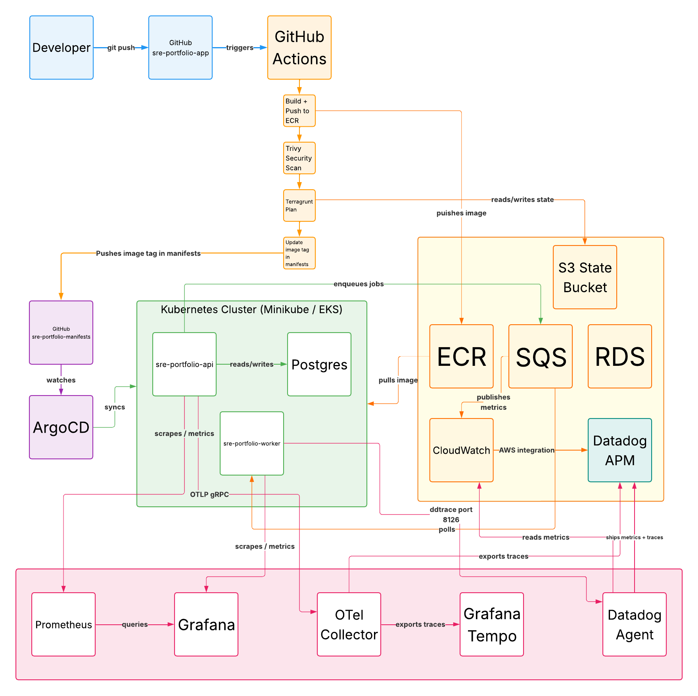

# SRE Portfolio Project

A production-grade SRE/DevOps portfolio demonstrating infrastructure automation,
container orchestration, GitOps, observability, and resilience engineering on AWS and Kubernetes.

## Architecture Overview



```
GitHub Actions CI/CD
        │
        ├── Build Docker images → ECR
        ├── Trivy security scan
        ├── Terragrunt infrastructure plan
        └── Update image tags in sre-portfolio-manifests
                │
                └── ArgoCD (GitOps)
                        │
                        └── Kubernetes (Minikube / EKS)
                                │
                                ├── API Service (FastAPI)
                                │       ├── Prometheus metrics
                                │       └── OTel traces → Collector → Tempo + Datadog
                                │
                                ├── Worker Service (FastAPI + ddtrace)
                                │       └── Datadog APM
                                │
                                └── Postgres
```

## Tech Stack

| Category | Technology |
|---|---|
| Cloud | AWS (ECR, SQS, RDS, EKS, CloudWatch) |
| IaC | Terraform, Terragrunt |
| Containers | Docker (multi-stage builds), Kubernetes |
| GitOps | ArgoCD |
| Package Management | Helm |
| CI/CD | GitHub Actions, Trivy (security scanning) |
| Metrics | Prometheus, Grafana |
| Tracing | OpenTelemetry, Grafana Tempo, Datadog APM |
| Application | Python, FastAPI, SQLAlchemy, PostgreSQL, SQS |

## Repositories

- **[sre-portfolio-app](https://github.com/HonorioTaveras/sre-portfolio-app)** -- Application code, Terraform/Terragrunt infrastructure, CI/CD pipeline
- **[sre-portfolio-manifests](https://github.com/HonorioTaveras/sre-portfolio-manifests)** -- Helm charts, ArgoCD Applications, observability config

## What I Built

### Infrastructure as Code (Days 1-2)
Provisioned a complete AWS environment using Terraform modules and Terragrunt for DRY
configuration management. Resources include VPC with public/private subnets, NAT Gateway,
EKS control plane, ECR repositories with lifecycle policies, SQS with DLQ, RDS Postgres,
CloudWatch alarms, and SNS notification topics. Remote state stored in S3 with DynamoDB
locking for team safety.

### Microservices Application (Day 3)
Built two FastAPI services implementing a job processing system. The API service accepts
job submissions, writes to Postgres, and enqueues to SQS. The worker service polls SQS
and processes jobs asynchronously. Both services expose Prometheus metrics and health
endpoints used by Kubernetes probes.

### Helm Charts and Kubernetes (Day 4)
Wrote complete Helm charts for both services with rolling update strategy
(`maxUnavailable: 0`, `maxSurge: 1`) for zero-downtime deployments. Configured readiness
and liveness probes, resource requests and limits, and IRSA-ready ServiceAccounts for
AWS permissions without stored credentials.

### GitOps with ArgoCD (Day 5)
Deployed ArgoCD and connected it to the manifests repository. Configured Applications
with `selfHeal: true` and `prune: true` so Git is always the source of truth. Demonstrated
self-healing by scaling deployments to zero and watching ArgoCD restore desired state
from Git within minutes.

### CI/CD Pipeline (Day 6)
Built a GitHub Actions pipeline with five jobs: build (Docker images pushed to ECR with
git SHA tags), scan (Trivy CVE scanning with documented ignore file), terraform-plan
(Terragrunt plan for infrastructure validation), deploy-dev (automatic GitOps image tag
update), and deploy-prod (manual approval gate via GitHub Environments).

### Observability Stack (Days 7-8)
Deployed `kube-prometheus-stack` for metrics collection and visualization. Built a Grafana
dashboard with four panels: request rate, P95 latency, total jobs, and job creation rate.
Deployed Grafana Tempo and OTel Collector for distributed tracing. Fixed a complex
OTel auto-instrumentation compatibility issue between Python 3.12, setuptools, and the
`opentelemetry-instrument` CLI wrapper. End-to-end traces visible in both Grafana Tempo
and Datadog simultaneously via OTel Collector fan-out.

### Datadog Integration (Day 9)
Deployed the Datadog Agent as a DaemonSet. Configured the OTel Collector with the native
Datadog exporter to fan traces out to both Grafana Tempo and Datadog APM simultaneously.
Both `sre-portfolio-api` and `sre-portfolio-worker` appear as services in Datadog APM
with full trace waterfall views.

### CloudWatch and AWS Monitoring (Day 10)
Created CloudWatch alarms for SQS queue depth monitoring with SNS notification routing.
Connected Datadog to AWS via CloudFormation integration for unified infrastructure and
application monitoring.

### Resilience Engineering (Day 11)
Demonstrated three resilience patterns documented in [runbooks](docs/runbooks.md):
- **Drift detection**: Terraform detected and reconciled unauthorized manual AWS changes
- **Self-healing**: Kubernetes replaced crashed pods in 14 seconds; ArgoCD restored scaled-down deployments in ~4 minutes
- **Chaos engineering**: Database pod deletion caused graceful degradation with automatic recovery

## Key Demonstrations

### Zero-Downtime Deployment
```bash
# Deploy bad image -- old pod stays Running, service never interrupts
kubectl set image deployment/sre-portfolio-api \
  api=sre-portfolio-api:broken -n sre-portfolio

# Verify service stays healthy during bad deploy
curl http://localhost:8080/health  # returns 200

# Rollback
kubectl set image deployment/sre-portfolio-api \
  api=sre-portfolio-api:latest -n sre-portfolio
```

### ArgoCD Self-Healing
```bash
# Manually scale to zero -- bypasses GitOps
kubectl scale deployment sre-portfolio-api --replicas=0 -n sre-portfolio

# ArgoCD detects drift and restores within ~4 minutes
# No human intervention required
```

### Terraform Drift Detection
```bash
# After manually changing AWS resource in console
terragrunt plan
# Terraform shows exactly what changed and what it will reconcile
```

## Running Locally

### Prerequisites
- Docker
- Minikube
- kubectl
- Helm
- Terraform + Terragrunt
- AWS CLI configured with `sre-portfolio` profile

### Start the application
```bash
# Start Minikube
minikube start

# Point Docker at Minikube
eval $(minikube docker-env)

# Build images
docker build -t sre-portfolio-api:latest services/api/
docker build -t sre-portfolio-worker:latest services/worker/

# Deploy via Helm
kubectl create namespace sre-portfolio
helm install sre-portfolio-api charts/api \
  --namespace sre-portfolio \
  --values charts/api/values-dev.yaml

# Port-forward
kubectl port-forward svc/sre-portfolio-api -n sre-portfolio 8080:80
curl http://localhost:8080/health
```

### Run tests
```bash
pytest services/api/tests/ -v
```

## Infrastructure Notes

EKS node group deployment is pending AWS EC2 vCPU quota approval on this account.
The EKS Terraform module is complete and validated. Minikube is used as the local
Kubernetes environment during development. All Kubernetes manifests and Helm charts
are production-ready and will deploy to EKS without modification once quota is approved.

## AWS Account
Account ID: `167715593994` | Region: `us-east-1`
